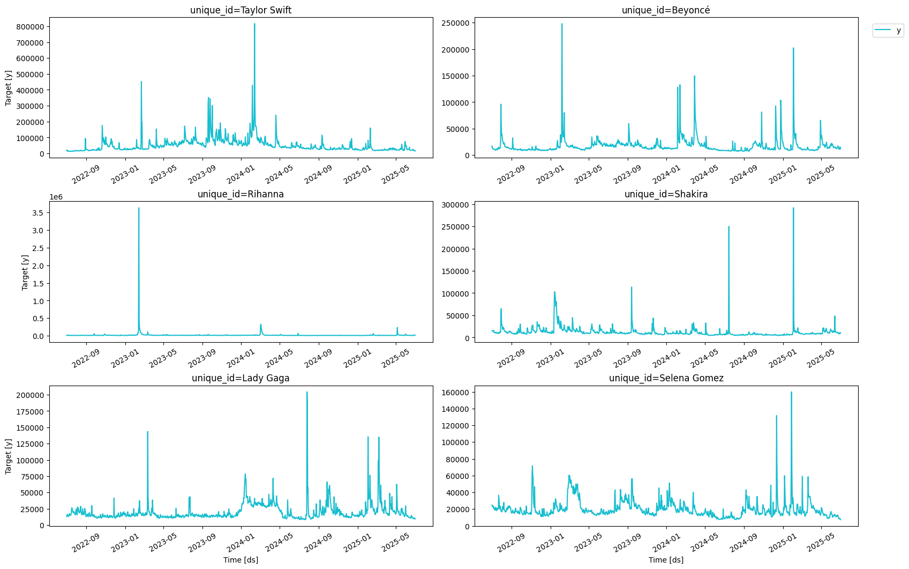
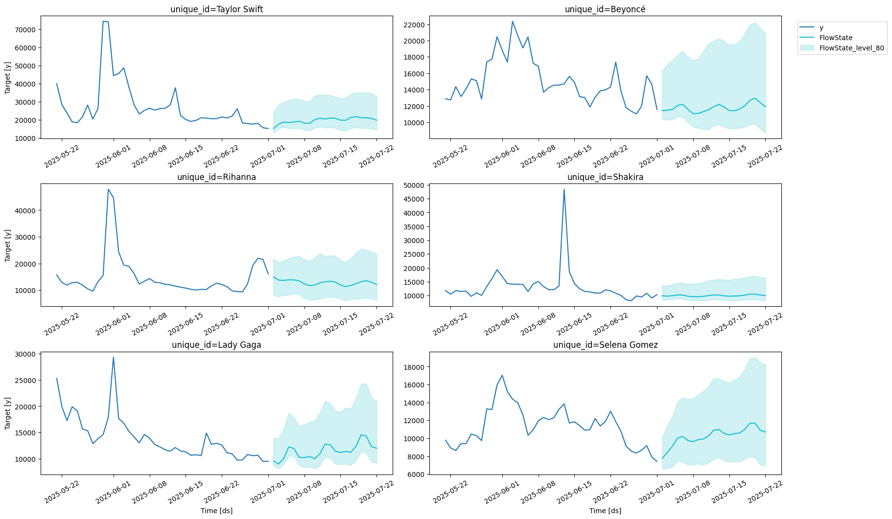
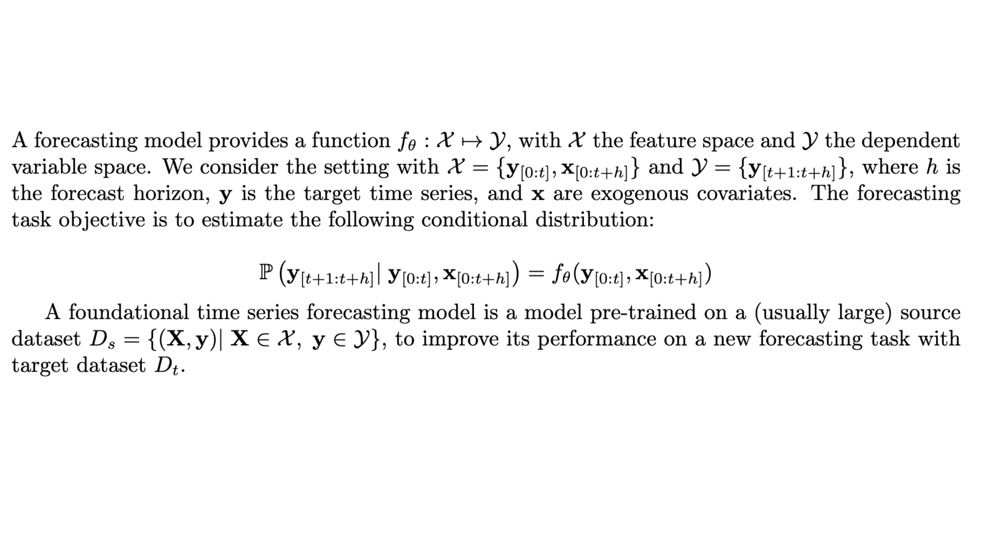
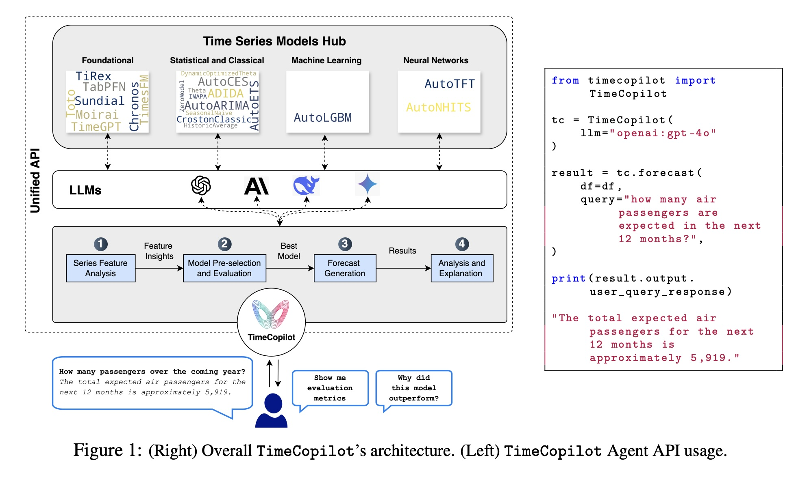
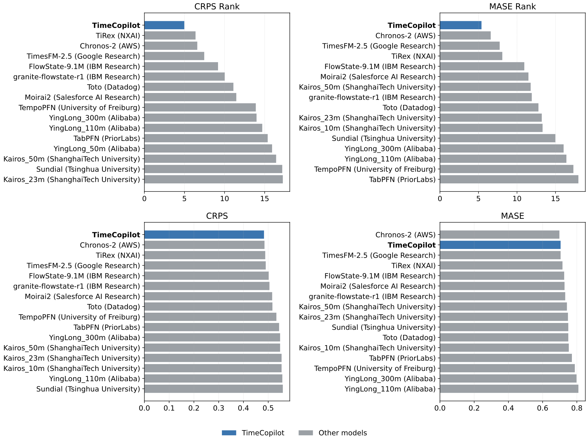

> everything starts with a question:

- _what is the future of forecasting?_

---

> but before that...

- _what is forecasting?_
- time series: numerical data ordered through time

---

---

> goal: predict the future, that's the forecasting problem

---

---

> lot of applications!!!

- macroeconomics
- finance
- manufacturing
- supply chain
- retail
- the list can go on and on...

---

> how has it been solved?

- stats approach: AutoARIMA, AutoETS, Theta, etc.
- ml approach: LightGBM, LinearRegression, etc. (you need to create features)
- dl approach: NHITS, NBEATS, LSTM, etc.

---

> which model to use?

- rely on pipelines: 
    - feature extraction
    - model selection
    - forecast generation
    - deployment
- new paradigm: foundation models

---

---

- TimeGPT-1 (Nixtla)
- Chronos (AWS)
- Moirai (Salesforce)
- FlowState (IBM)
- TiRex (NXAI)
- Toto (DataDog)
- Sundial (Tsinghua University)
- ...

---

> which model to use?

- rely on pipelines: 
    - feature extraction
    - model selection
    - forecast generation
    - deployment

---

> at the same time, in the AI space...

---

---

> agents are *everywhere*: automating pipelines

- GitHub Copilot agents
- GPTs as autonomous task-runners
- Gemini CLI, AutoGPT, BabyAGI, Devin

---

> where are the forecasting agents?

- forecasting = high-impact, technical, widely needed
- but: little agent-based experimentation

- yet it’s a perfect fit:
    - model selection
    - error diagnosis
    - data cleaning
    - code generation

---

---

- TimeCopilot is a generative agent that applies a systematic forecasting approach using large language models (LLMs) to:
    - interpret statistical features and patterns
    - guide model selection based on data characteristics
    - explain technical decisions in natural language
    - answer domain-specific questions about forecasts

---

---

> features

- largest hub of time series foundation models: +30
- support for any llm compatible with pydantic-ai
- 1st place in the gift-eval benchmark amongst open-source solutions

---

---

> let's go live!

- `uv add timecopilot`
- TimeCopilot: The GenAI Forecasting Agent · LLMs × Foundation Time Series Models
- `https://github.com/AzulGarza/TimeCopilot` ⭐️
- `timecopilot.dev`

_happy genai forecasting!_ 

---

