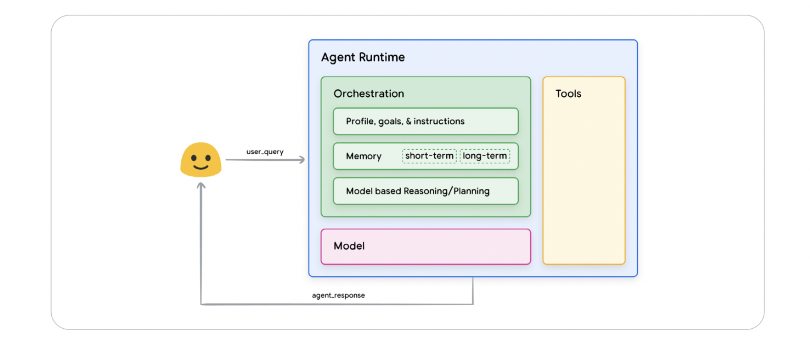
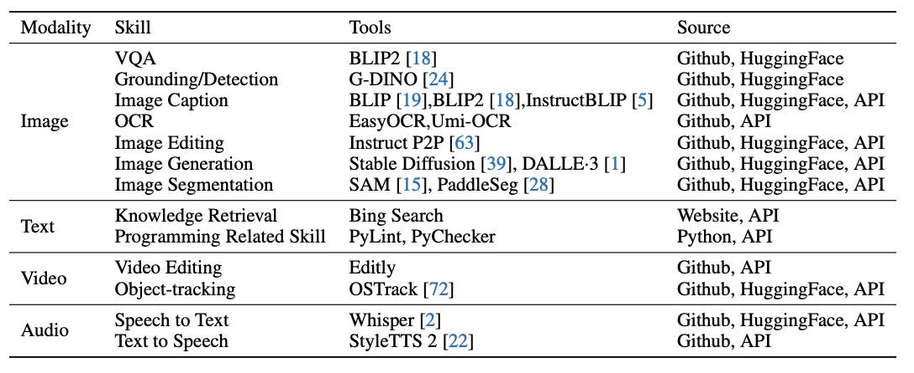

> what's all this hype around ai agents?

- agents are trending across domains 
    - code development
    - research
    - chat and productivity
    - web and browsing
    - enterprise workflows
    - multimodal assistants
- searches for "AI agents" have surged dramatically


---


---

> agents are *everywhere*

- GitHub Copilot agents
- GPTs as autonomous task-runners
- ReAct, AutoGPT, BabyAGI, Devin

---

> and the agent wave will grow

---

> but what *is* an AI agent?


---



---

> agent runtime

- **orchestration:** what’s the goal? what are the rules?
- **memory:** 
    - short-term: what's happening right now?
    - long-term: what do we already know about the user?

- **reasoning & planning:** thinks through what to do next

---

> model

- the brain. usually a large language model doing the heavy thinking

---

> tools

- external helpers: functions, apis, or models the agent can call to get things done  
  (for example: forecast(), plot(), explain_model())

---

> a simpler definition, by LangChain

- "a system that uses an LLM to decide the control flow of an application"

---

> a mathematical intuition

```
loop:
  observe environment
  reason (LLM)
  choose best action
  update state
  repeat until goal or termination
```

- agents = planning + tool use + feedback

---

> agents across modalities


---




---

> where are the forecasting agents?

- forecasting = high-impact, technical, widely needed
- but: little agent-based experimentation

- yet it’s a perfect fit:
    - model selection
    - error diagnosis
    - data cleaning
    - code generation

---

> opportunity: open source can be a good place to experiment

- current focus on language, vision, robotics
- time series is often underhyped

- we have the tools:
    - foundation time series models, open source tools (Nixtla, GluonTS, SkTime, etc...)
    - LangChain, OpenAI, Claude, Mistral

---

> why forecasting needs agents, and why now

- forecasting is complex and messy
- agents make it navigable and human-friendly
- no one’s cracked this yet

---

> let's go live!


- TimeCopilot: The GenAI Forecasting Agent · LLMs × Foundation Time Series Models
- just `uv add timecopilot`
